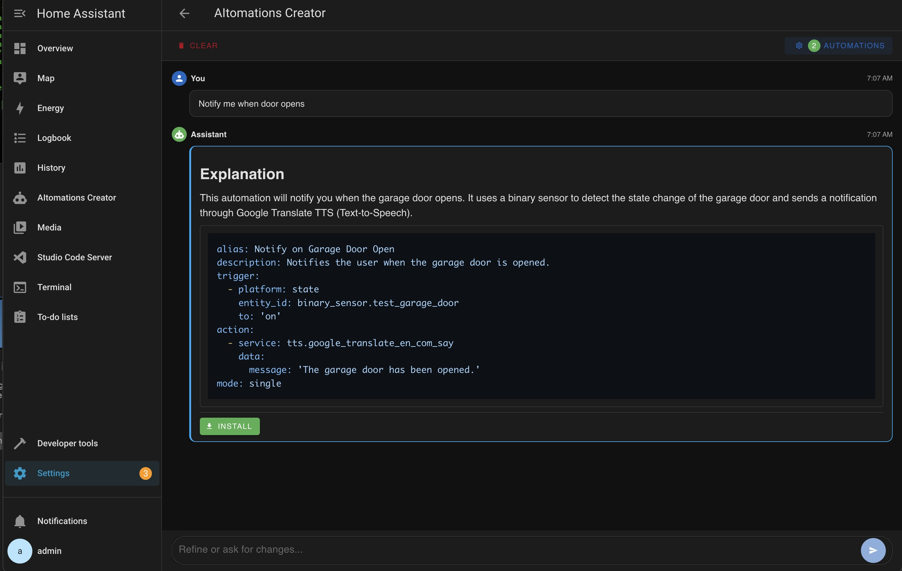

# AItomations Creator

Create Home Assistant automations using natural language! Just describe what you want, and let AI generate the YAML for you.

## Features

- 🗣️ **Natural Language** - Describe automations in plain English
- 🤖 **Multiple AI Providers** - Google Gemini (cloud) or Ollama (local)
- 🎯 **Context-Aware** - Automatically knows your entities
- 💬 **Conversational** - Refine automations through chat
- ⚡ **Real-time Streaming** - See AI responses as they generate
- 👀 **Review First** - Preview YAML before installing
- 🎨 **Modern UI** - Clean, responsive interface

## Configuration

### Using Google Gemini (Cloud)

1. Get an API key from [Google AI Studio](https://makersuite.google.com/app/apikey)
2. Set **LLM Provider** to `gemini`
3. Enter your **Gemini API Key**

### Using Ollama (Local)

1. Install and run Ollama on your network
2. Set **LLM Provider** to `ollama`
3. Enter your **Ollama API URL** (e.g., `http://192.168.1.100:11434`)
4. Optionally change the **Ollama Model** (default: `llama3.2:latest`)

## Usage

1. Start the add-on
2. Click **Open Web UI**
3. Describe your automation in plain English
4. Review the generated YAML
5. Click **Install** to add it to Home Assistant

## Example Prompts

- "Turn on the living room lights when motion is detected after sunset"
- "Send a notification when the garage door is open for more than 10 minutes"
- "Set the thermostat to 68°F when I arrive home"

## Support

- [Documentation](https://github.com/gmatrangola/AItomation)
- [Report Issues](https://github.com/gmatrangola/AItomation/issues)
- [Discussions](https://github.com/gmatrangola/AItomation/discussions)